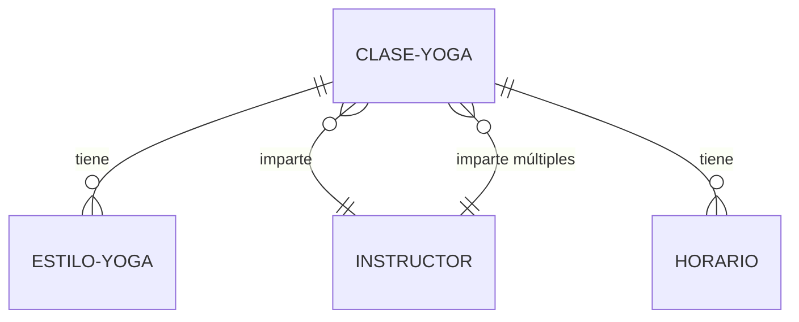

# Skill: Definir Arquitectura WordPress

## Propósito

Crear el documento `docs/arquitectura.md` con especificación completa de entidades, campos, relaciones y reglas de acceso, aplicando el protocolo de análisis OBLIGATORIO de 4 pasos y las 4 reglas críticas.

## Cuándo Usar

- Fase 5 del proyecto (Arquitectura)
- Cuando el Arquitecto necesita definir el modelo de datos
- Después de tener estrategia, planificación, wireframes y stack

## Inputs Requeridos

### Obligatorios
- **`docs/estrategia.md`**: Qué ofrece el negocio, si es transaccional
- **`docs/planificacion-urls.csv`**: Templates/URLs que existen
- **`docs/wireframes.md`**: Bloques de contenido por template
- **`docs/stack.md`**: ¿Usa WooCommerce? ¿JetEngine?

## Proceso

### PROTOCOLO DE ANÁLISIS OBLIGATORIO (4 Pasos)

#### **Paso 1: Leer Artefactos de Entrada**

**De estrategia.md extraer**:
```
¿Qué ofrece el negocio?
  → [Lista de servicios/productos/contenidos]

¿Es transaccional? (vende con pago)
  → [Sí/No]

Vocabulario del negocio:
  → [Términos específicos de la industria]
```

**De planificacion-urls.csv extraer**:
```
Templates con single-[X]:
  → Identificar [X] = posible CPT

Templates con archive-[Y]:
  → Identificar [Y] = posible CPT o taxonomía

Análisis:
  → single-clase-yoga = CPT "clase-yoga"
  → archive-estilo-yoga = Taxonomía "estilo-yoga"
```

**De wireframes.md extraer**:
```
Bloques de contenido por template:
  → Hero: título, subtítulo, imagen, CTA
  → Beneficios: lista de items (repeater)
  → Testimonios: nombre, cargo, foto, texto (repeater)
  → FAQ: pregunta, respuesta (repeater)

Datos necesarios:
  → Campos personalizados requeridos
```

**De stack.md extraer**:
```
¿Usa WooCommerce?
  → Si SÍ: NO crear CPT productos (usar WooCommerce product)
  → Si NO: Evaluar si necesita CPT productos

¿Usa JetEngine?
  → Si SÍ: Campos se gestionan vía JetEngine
  → Si NO: Campos en código (ACF o nativo)
```

---

#### **Paso 2: Identificar Entidades del PROYECTO ESPECÍFICO**

**⚠️ NO ASUMIR entidades genéricas**

**Preguntas clave**:

**¿Qué ofrece el negocio?** → CPTs principales
```
Consultoría → CPT "consultoria" (no genérico "servicio")
Productos físicos → WooCommerce "product" (NO CPT propio)
Clases de yoga → CPT "clase-yoga" (no genérico "servicio")
Propiedades inmobiliarias → CPT "propiedad" (no "producto")
Funcionalidades SaaS → CPT "funcionalidad" (no "servicio")
```

**¿Necesita ecommerce?** → Usar WooCommerce
```
Si stack.md incluye WooCommerce:
  → Productos: WooCommerce "product" ✅
  → Pedidos: WooCommerce "shop_order" ✅
  → NO crear CPT propios que dupliquen WooCommerce ❌
```

**¿Hay suscripciones/membresías?**
```
Evaluar:
  → CPT "membership" custom
  → Plugin MemberPress
  → Plugin Restrict Content Pro
```

**¿Hay reservas/citas?**
```
Evaluar:
  → Plugin Amelia/Bookly (si complejo)
  → CPT "booking" custom (si simple)
```

**¿Es directorio?**
```
CPT por tipo de listing:
  → "restaurante", "hotel", "empresa"
```

**¿Es blog/magazine?**
```
Usar "post" nativo + taxonomías
O CPT personalizado si campos muy específicos
```

**Crear tabla de análisis**:
```markdown
| Entidad Identificada | Origen | Tipo | Justificación | Nombre Final |
|---------------------|--------|------|---------------|--------------|
| Clases que ofrece | estrategia.md | CPT | Necesita single `/clases/[slug]` | clase-yoga |
| Estilos de yoga | wireframes: "filtrar por estilo" | Taxonomía | Clasificación | estilo-yoga |
| Instructores | estrategia: "equipo de 5" | CPT | Bios individuales | instructor |
```

---

#### **Paso 3: Nombrar Según el DOMINIO DEL NEGOCIO**

**⚠️ REGLA CRÍTICA: NO usar nombres genéricos si existe vocabulario propio**

**Análisis por industria**:

**Escuela de yoga**:
```
❌ MAL (genérico):
- CPT: servicio
- Taxonomía: categoria

✅ BIEN (dominio del negocio):
- CPT: clase-yoga
- Taxonomía: estilo-yoga (Hatha, Vinyasa, Kundalini)
- CPT: instructor
```

**Inmobiliaria**:
```
❌ MAL:
- CPT: producto
- Taxonomía: tipo

✅ BIEN:
- CPT: propiedad
- Taxonomía: tipo-propiedad (Piso, Casa, Local)
- Taxonomía: zona (Barcelona Centro, Eixample, Gràcia)
```

**SaaS**:
```
❌ MAL:
- CPT: servicio
- CPT: caso-exito

✅ BIEN:
- CPT: funcionalidad (features del software)
- CPT: caso-uso (casos específicos del sector)
- Taxonomía: sector (Ecommerce, SaaS, Educación)
```

**Proceso de decisión**:
1. ¿Tiene vocabulario propio la industria? → Usar ese
2. ¿Es término estándar? → Usar estándar
3. ¿Hay ambigüedad? → Consultar al Jefe de Proyectos

---

#### **Paso 4: Validar Contra Planificación**

**Cada entidad debe corresponder a templates en CSV**:

```markdown
Análisis de planificacion-urls.csv:

URL: /clases/hatha-yoga-principiantes/
Template: single-clase-yoga
→ Necesita CPT "clase-yoga" ✅

URL: /clases/estilo/vinyasa/
Template: archive-estilo-yoga  
→ Necesita Taxonomía "estilo-yoga" ✅

URL: /instructores/maria-garcia/
Template: single-instructor
→ Necesita CPT "instructor" ✅
```

**Regla**: NO crear entidades que no aparecen en planificación.

**Validación**:
- [ ] Todas las URLs con `single-[x]` tienen CPT
- [ ] Todas las URLs con `archive-[x]` tienen CPT o taxonomía
- [ ] No hay CPTs sin URLs que los usen

---

### APLICAR LAS 4 REGLAS OBLIGATORIAS

#### **Regla 1: Mínimo `content`, Máximo Campos Personalizados**

**Filosofía**: Evitar el campo `content` de WordPress.

**Por cada CPT, definir campos estructurados**:

✅ **BIEN**:
```markdown
### CPT: clase-yoga

**Campos personalizados**:
- `titulo` (text) - Nombre de la clase
- `descripcion_corta` (textarea, 150 chars) - Para listados
- `duracion` (number) - Minutos
- `nivel` (select: Principiante, Intermedio, Avanzado)
- `beneficios` (repeater)
  - beneficio_titulo (text)
  - beneficio_descripcion (textarea)
- `que_traer` (repeater: item text)
- `instructor` (relationship → CPT instructor)
- `galeria` (gallery) - Fotos de la clase

**Uso de `content`**: ❌ NO (todo estructurado)

**Ratio**: 100% campos personalizados, 0% content ✅
```

❌ **MAL**:
```markdown
### CPT: servicio

**Campos**:
- titulo (text)
- content (wysiwyg) - Todo el contenido mezclado

**Ratio**: 10% campos, 90% content ❌
```

**⚠️ ÚNICO USO VÁLIDO de `content`**:
- Textos largos sin estructura: "Historia empresa", "Bio autor"

---

#### **Regla 2: Criterio CPT vs CCT**

**Usar CPT (Custom Post Type) cuando**:
- Necesita single (URL pública propia)
- Debe indexarse en Google
- Debe estar en API REST (para integraciones)

**Usar CCT (Custom Content Type / Tabla) cuando**:
- Tabla intermedia de relación N:N
- Datos privados sin single
- No debe indexarse en Google

**Decisión por entidad**:
```markdown
Entidad: Testimonios

Análisis:
- ¿Necesita single público? NO (solo se muestran en listados)
- ¿Debe indexarse? NO
- ¿Muchos campos estructurados? SÍ (nombre, cargo, empresa, foto, texto)

Decisión: Campo repeater en página O CPT simple sin single
Si >20 testimonios: CPT (más manejable)
Si <10 testimonios: Repeater en página
```

---

#### **Regla 3: Si Transaccional, Usar WooCommerce**

**Verificar en stack.md**:
```
Si stack.md incluye WooCommerce:
  → Productos: product (WooCommerce) ✅
  → Pedidos: shop_order (WooCommerce) ✅
  → Variaciones: product_variation ✅
  → Campos extra: Meta fields en productos ✅
  
Si stack.md NO incluye WooCommerce pero estrategia.md es transaccional:
  → ⚠️ ERROR EN STACK
  → Avisar al Jefe de Proyectos
  → Requiere corrección de Fase 4
```

**Documentar en arquitectura.md**:
```markdown
## Entidades de Ecommerce

**Base**: WooCommerce

### Productos
- **CPT**: `product` (WooCommerce nativo)
- **Campos nativos**: título, descripción, precio, stock, galería, categorías
- **Campos extra** (vía JetEngine):
  - `especificacion_tecnica` (textarea)
  - `manual_pdf` (file)
  - `video_demo` (url)

### Categorías de Productos
- **Taxonomía**: `product_cat` (WooCommerce nativa)
- **O crear taxonomía custom** si necesaria

**NO crear CPT productos propio** ❌
```

---

#### **Regla 4: Nomenclatura Según Dominio**

**Proceso**:
1. Analizar vocabulario de estrategia.md
2. Usar términos del cliente/industria
3. Evitar genéricos si hay específicos
4. Consultar ante duda

**Documentar decisiones**:
```markdown
## Nomenclatura

**Decisión**: Usar vocabulario propio del dominio

| Genérico | Específico del Proyecto | Justificación |
|----------|------------------------|---------------|
| servicio | clase-yoga | El negocio ofrece "clases", no servicios genéricos |
| categoria | estilo-yoga | Clasificación es por estilo (Hatha, Vinyasa...) |
| producto | propiedad | Inmobiliaria vende propiedades, no productos |

**Vocabulario del cliente**:
[Términos específicos identificados en estrategia.md]
```

---

### Definir Campos Personalizados

**Por cada CPT/CCT**, especificar campos completos:

```markdown
### CPT: [nombre-cpt]

**Slug**: [slug-url]
**Plural**: [Nombre Plural]
**Singular**: [Nombre Singular]
**Público**: [Sí/No]
**Tiene Archive**: [Sí/No]
**Show in REST**: [Sí/No]

**Campos personalizados**:

1. **[nombre_campo]** (tipo: text)
   - Label: [Label visible]
   - Obligatorio: [Sí/No]
   - Placeholder: [Si aplica]
   - Validación: [Si aplica]

2. **[nombre_campo_2]** (tipo: textarea)
   - Label: [Label]
   - Max caracteres: [150]
   - Uso: [Para qué sirve este campo]

3. **[nombre_repeater]** (tipo: repeater)
   - Label: [Label]
   - Subcampos:
     - [subcampo_1] (text)
     - [subcampo_2] (textarea)
   - Uso: [Ej: Lista de beneficios]

[... todos los campos necesarios según wireframes]

**Uso de `content`**: [SÍ/NO - justificar si SÍ]

**Ratio campos/content**: [XX% campos, XX% content]
```

---

### Definir Taxonomías

```markdown
### Taxonomía: [nombre-taxonomia]

**Slug**: [slug]
**Asociada a CPT**: [nombre-cpt]
**Jerárquica**: [Sí/No]
**Show in REST**: [Sí/No]

**Términos iniciales**:
- [Término 1]
- [Término 2]
- [Término 3]

**Uso**: [Para qué sirve esta clasificación]
```

---

### Definir Relaciones

**Tipos**:

**1:N (Uno a muchos)**:
```markdown
### Relación: Instructor → Clases (1:N)

**Descripción**: 1 instructor puede impartir múltiples clases

**Implementación**:
- Campo en CPT `clase-yoga`: `instructor_id` (relationship field)
- Tipo: Post Object (ACF) o Relation (JetEngine)
- Obligatorio: Sí
- Múltiple: No (1 instructor por clase)

**Query ejemplo**:
Obtener todas las clases de un instructor:
```php
$args = array(
    'post_type' => 'clase-yoga',
    'meta_query' => array(
        array(
            'key' => 'instructor_id',
            'value' => $instructor_post_id,
        ),
    ),
);
```
```

**N:N (Muchos a muchos)**:
```markdown
### Relación: Productos ↔ Características (N:N)

**Descripción**: Productos pueden tener múltiples características, características pueden estar en múltiples productos

**Implementación**:
- **Con JetEngine**: JetEngine Relations
- **Sin JetEngine**: CCT intermedia (tabla)

**Tabla intermedia** (si no JetEngine):
- `producto_id` (int)
- `caracteristica_id` (int)
```

---

### Crear Diagrama Mermaid

**Representar visualmente entidades y relaciones**:



---

### Estructura del Documento Final

```markdown
---
tipo: arquitectura
estado: vigente
fase: arquitectura
version: 1
responsable: arquitecto
creado: YYYY-MM-DD
ultima_revision: YYYY-MM-DD
validado_por: null
validado_en: null
impactado_por_evento: false
---

# Arquitectura de Datos - [Nombre Proyecto]

## Análisis de Artefactos de Entrada

### Estrategia
[Resumen: qué ofrece, si es transaccional, vocabulario del negocio]

### Planificación
[Templates identificados: single-X, archive-Y]

### Wireframes
[Bloques de contenido, datos necesarios por template]

### Stack
[WooCommerce?, JetEngine?, Sistema de gestión de CPTs]

---

## Entidades Identificadas

[Tabla de análisis completa]

---

## Custom Post Types (CPT)

### CPT 1: [nombre-cpt]
[Especificación completa con campos]

### CPT 2: [nombre-cpt-2]
[Especificación completa]

---

## Custom Content Types (CCT)

[Solo si aplica - tablas custom]

### CCT 1: [nombre-cct]
[Especificación]

---

## Taxonomías

### Taxonomía 1: [nombre-taxonomia]
[Especificación completa]

---

## Relaciones

### Relación 1: [entidad-a] → [entidad-b]
[Tipo: 1:N o N:N]
[Implementación]

---

## WooCommerce (si transaccional)

[Especificación de uso de entidades WooCommerce + campos extra]

---

## Diagrama de Entidades

```mermaid
[Diagrama Mermaid completo]
```

---

## Validación de Reglas Obligatorias

- [x] **Regla 1**: Mínimo content, máximo campos - Aplicada (ratio: XX% campos)
- [x] **Regla 2**: Criterio CPT/CCT - Aplicado y justificado
- [x] **Regla 3**: WooCommerce si transaccional - [Aplicada / No aplica]
- [x] **Regla 4**: Nomenclatura según dominio - Aplicada

---

## Notas de Implementación

**Sistema de gestión** (según stack.md):
- [JetEngine vía interfaz / Código en plugin propio]

**Próximos pasos**:
- Implementador: Configurar JetEngine O
- Programador: Desarrollar código de registro
```

---

## Output Esperado

**Documento**: `docs/arquitectura.md`

**Contenido completo**:
- Análisis de 4 artefactos de entrada
- Tabla de entidades identificadas
- Especificación de cada CPT con campos
- Especificación de cada CCT (si aplica)
- Especificación de taxonomías
- Especificación de relaciones
- Diagrama Mermaid
- Validación de 4 reglas obligatorias

---

## Criterios de Validación

- [ ] **Análisis de artefactos completo** (estrategia, planificación, wireframes, stack)
- [ ] **Entidades de wireframes mapeadas** (todas tienen campos)
- [ ] **Templates de planificación tienen entidad** (todas las URLs cubiertas)
- [ ] **Criterio CPT/CCT aplicado** (justificado)
- [ ] **Relaciones documentadas** (1:N, N:N con implementación)
- [ ] **Campos estructurados** (ratio ≥80/20)
- [ ] **Si transaccional, WooCommerce base** (verificado)
- [ ] **Nombres según dominio** (no genéricos)
- [ ] **Diagrama Mermaid incluido** (visual)

---

## Errores Comunes

### ❌ Copiar Ejemplos Sin Analizar
**Mal**:
```
Cualquier proyecto:
- CPT: servicio
- CPT: caso-exito
- Taxonomía: categoria
[Copiado del documento sin analizar]
```

**Bien**:
```
Proyecto: Escuela de Yoga
Análisis:
- Ofrece: clases de yoga
- Vocabulario: estilos (Hatha, Vinyasa)
- Decisión:
  - CPT: clase-yoga ✅
  - Taxonomía: estilo-yoga ✅
[Analizado y adaptado al proyecto]
```

### ❌ Usar `content` Para Todo
**Mal**:
```
CPT: clase-yoga
Campos:
- titulo
- content (todo mezclado)
```

**Bien**:
```
CPT: clase-yoga
Campos estructurados:
- titulo
- descripcion_corta (150 chars)
- duracion (number)
- nivel (select)
- beneficios (repeater: titulo + descripcion)
- que_traer (repeater: item)
- instructor (relationship)
- galeria (gallery)
Uso de content: NO ✅
```

### ❌ Crear CPT Cuando Debe Usar WooCommerce
**Mal**:
```
Negocio: Tienda online
→ Crear CPT "producto" propio ❌
```

**Bien**:
```
Negocio: Tienda online
→ stack.md incluye WooCommerce
→ Usar WooCommerce "product" ✅
→ Añadir campos extra si necesario
```

---

## Notas

- Esta skill es ejecutada por el **Arquitecto**
- Requiere análisis profundo y aplicación estricta de las 4 reglas
- Es la fase que más impacta el desarrollo técnico posterior
- **Si arquitectura está mal, la implementación estará mal**
