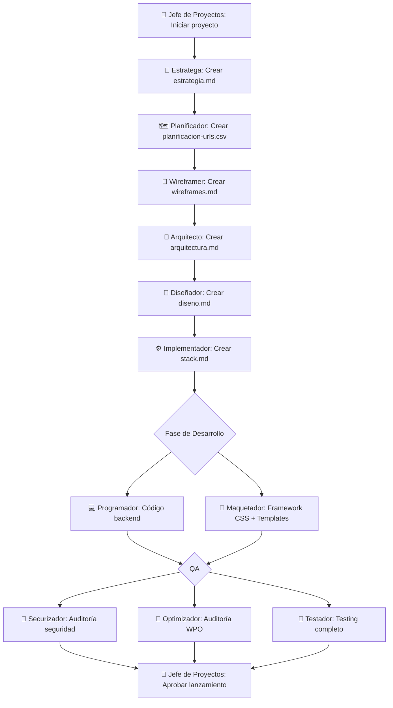

# Guía de Uso: Sistema de Modos Custom del Sistema LMB

**Versión**: 2.0 (Formato correcto `.roomodes`)  
**Fecha**: 2025-01-20

---

## 📖 Introducción

El Sistema LMB utiliza 12 modos custom especializados que se configuran mediante el archivo **`.roomodes`** en la raíz del proyecto. Cada modo tiene un rol específico en el flujo de trabajo del sistema.

---

## 🏗️ Arquitectura del Sistema

### Estructura de Archivos

```
SISTEMA_LMB/
├── .roomodes                    # Configuración de los 12 modos
├── docs/
│   └── modes-reference/         # Documentación detallada de cada modo
│       ├── jefe-proyectos-full.md
│       ├── estratega-full.md
│       ├── planificador-full.md
│       ├── wireframer-full.md
│       ├── arquitecto-full.md
│       ├── disenador-full.md
│       ├── implementador-full.md
│       ├── programador-full.md
│       ├── maquetador-full.md
│       ├── securizador-full.md
│       ├── optimizador-full.md
│       └── testador-full.md
└── .roo/
    └── skills/                  # Skills del sistema (mantener)
```

---

## 🎭 Los 12 Modos del Sistema LMB

### 1. 🧭 Jefe de Proyectos (Orquestador)
**Slug**: `jefe-proyectos`  
**Cuándo usar**: Al iniciar proyectos, coordinar fases, validar entregables, gestionar eventos

**Responsabilidades**:
- Coordinar fases y delegar a especialistas
- Mantener `roadmap.md` actualizado
- Validar outputs de cada fase
- Gestionar eventos de cambio del negocio

**Permisos**:
- ✅ Lee todos los archivos
- 📝 Edita: `roadmap.md`, `docs/eventos/*.md`, `docs/validaciones/*.md`
- 🌐 Usa navegador

**Documentación completa**: [`docs/modes-reference/jefe-proyectos-full.md`](modes-reference/jefe-proyectos-full.md)

---

### 2. 🧠 Estratega
**Slug**: `estratega`  
**Cuándo usar**: Crear estrategia inicial, definir audiencias, analizar competencia

**Responsabilidades**:
- Realizar briefing con el cliente
- Crear `docs/estrategia.md` completo (8 secciones)
- Definir mínimo 3 perfiles de audiencia (15 campos cada uno)
- Mapear servicios/productos a perfiles

**Permisos**:
- ✅ Lee todos los archivos
- 📝 Edita: `docs/estrategia.md`, `docs/propuestas/*.md`
- 🌐 Usa navegador

**Documentación completa**: [`docs/modes-reference/estratega-full.md`](modes-reference/estratega-full.md)

---

### 3. 🗺 Planificador
**Slug**: `planificador`  
**Cuándo usar**: Crear planificación de URLs, asignar keywords, definir templates

**Responsabilidades**:
- Crear `docs/planificacion-urls.csv`
- Hacer keyword research real
- Asignar cada keyword a UNA URL destino
- Definir CTAs y requisitos de conversión

**Permisos**:
- ✅ Lee todos los archivos
- 📝 Edita: `docs/planificacion-urls.csv`
- 🌐 Usa navegador

**Documentación completa**: [`docs/modes-reference/planificador-full.md`](modes-reference/planificador-full.md)

---

### 4. 🧩 Wireframer
**Slug**: `wireframer`  
**Cuándo usar**: Crear wireframes de templates, definir jerarquía de contenido

**Responsabilidades**:
- Crear `docs/wireframes.md` con todos los templates
- Definir jerarquía de contenido
- Marcar camino hacia el CTA
- Incluir diagramas ASCII de wireframes

**Permisos**:
- ✅ Lee todos los archivos
- 📝 Edita: `docs/wireframes.md`
- 🌐 Usa navegador

**Documentación completa**: [`docs/modes-reference/wireframer-full.md`](modes-reference/wireframer-full.md)

---

### 5. 🧱 Arquitecto
**Slug**: `arquitecto`  
**Cuándo usar**: Definir arquitectura de datos, especificar CPTs/CCTs, crear modelo de entidades

**Responsabilidades**:
- Analizar artefactos previos
- Crear `docs/arquitectura.md` con diagrama Mermaid
- Definir CPTs, CCTs, taxonomías y campos
- Aplicar 4 reglas críticas de arquitectura

**Permisos**:
- ✅ Lee todos los archivos
- 📝 Edita: `docs/arquitectura.md`
- 🌐 Usa navegador

**Documentación completa**: [`docs/modes-reference/arquitecto-full.md`](modes-reference/arquitecto-full.md)

---

### 6. 🎨 Diseñador
**Slug**: `disenador`  
**Cuándo usar**: Crear sistema de diseño, definir paleta de colores, especificar componentes

**Responsabilidades**:
- Crear `docs/diseno.md`
- Definir paleta de colores completa
- Especificar tipografía
- Diseñar componentes visuales

**Permisos**:
- ✅ Lee todos los archivos
- 📝 Edita: `docs/diseno.md`
- 🌐 Usa navegador

**Documentación completa**: [`docs/modes-reference/disenador-full.md`](modes-reference/disenador-full.md)

---

### 7. ⚙️ Implementador
**Slug**: `implementador`  
**Cuándo usar**: Definir stack técnico, elegir plugins, especificar hosting

**Responsabilidades**:
- Crear `docs/stack.md`
- Decidir tema vs builder
- Elegir plugins según necesidades
- Crear plan de implementación

**Permisos**:
- ✅ Lee todos los archivos
- 📝 Edita: `docs/stack.md`, `docs/setup.md`, `docs/implementacion-*.md`
- 🌐 Usa navegador

**Documentación completa**: [`docs/modes-reference/implementador-full.md`](modes-reference/implementador-full.md)

---

### 8. 💻 Programador
**Slug**: `programador`  
**Cuándo usar**: Escribir código PHP/JS/CSS, crear plugins, implementar funcionalidades

**Responsabilidades**:
- Desarrollar plugin propio
- Registrar CPTs, taxonomías y campos (si gestión por código)
- Desarrollar functions.php
- Crear shortcodes y hooks

**Permisos**:
- ✅ Lee todos los archivos
- 📝 Edita todos los archivos (necesita acceso completo al código)
- 🌐 Usa navegador

**Documentación completa**: [`docs/modes-reference/programador-full.md`](modes-reference/programador-full.md)

---

### 9. 🧱 Maquetador
**Slug**: `maquetador`  
**Cuándo usar**: Crear Framework CSS, maquetar templates, implementar diseño responsive

**Responsabilidades**:
- Crear Framework CSS LMB (guía de estilos, CSS, documentación)
- Maquetar templates según wireframes
- Implementar diseño responsive mobile-first
- Aplicar nomenclatura BEM

**Permisos**:
- ✅ Lee todos los archivos
- 📝 Edita todos los archivos (necesita acceso completo)
- 🌐 Usa navegador

**Documentación completa**: [`docs/modes-reference/maquetador-full.md`](modes-reference/maquetador-full.md)

---

### 10. 🔐 Securizador
**Slug**: `securizador`  
**Cuándo usar**: Auditar seguridad, aplicar hardening, revisar código vulnerable

**Responsabilidades**:
- Auditar seguridad con checklist completa
- Crear `docs/reporte-seguridad.md`
- Implementar mejoras de seguridad
- Configurar plugins de seguridad

**Permisos**:
- ✅ Lee todos los archivos
- 📝 Edita todos los archivos (necesita implementar correcciones)
- 🌐 Usa navegador

**Documentación completa**: [`docs/modes-reference/securizador-full.md`](modes-reference/securizador-full.md)

---

### 11. 🚀 Optimizador
**Slug**: `optimizador`  
**Cuándo usar**: Optimizar rendimiento, mejorar Core Web Vitals, reducir tiempos de carga

**Responsabilidades**:
- Auditar rendimiento con herramientas profesionales
- Crear `docs/reporte-wpo.md`
- Optimizar imágenes y assets
- Implementar caché y minificación

**Permisos**:
- ✅ Lee todos los archivos
- 📝 Edita todos los archivos (necesita implementar optimizaciones)
- 🌐 Usa navegador

**Documentación completa**: [`docs/modes-reference/optimizador-full.md`](modes-reference/optimizador-full.md)

---

### 12. 🧪 Testador
**Slug**: `testador`  
**Cuándo usar**: Ejecutar testing completo, validar funcionalidades, reportar bugs

**Responsabilidades**:
- Crear `docs/testing/plan.md`
- Ejecutar testing funcional, usabilidad, compatibilidad
- Reportar bugs
- Validar correcciones

**Permisos**:
- ✅ Lee todos los archivos
- 📝 Edita: `docs/testing/*.md`, `docs/testing/reportes/*.md`
- 🌐 Usa navegador

**Documentación completa**: [`docs/modes-reference/testador-full.md`](modes-reference/testador-full.md)

---

## 🔄 Flujo de Trabajo Típico



---

## 🎯 Cómo Cambiar de Modo

### En Roo Code (VS Code)

1. **Abrir selector de modos**: Busca el dropdown en la interfaz de Roo Code
2. **Seleccionar modo**: Click en el modo que necesitas
3. **Confirmar cambio**: El modo activo se muestra en la interfaz

### Comando Directo

También puedes mencionar el modo en tu prompt:
```
"Cambia a modo 🧠 Estratega y ayúdame a crear la estrategia para este proyecto"
```

---

## 📚 Acceso a Documentación Detallada

Cada modo tiene instrucciones compactas en su configuración, pero puede acceder a la **documentación completa** cuando lo necesite:

**Ejemplo**: Si estás en modo Estratega y necesitas más detalles:
```
"Lee docs/modes-reference/estratega-full.md y explícame los 15 campos obligatorios de un perfil de audiencia"
```

---

## ⚙️ Permisos por Modo

### Tipos de Permisos

- **read**: Puede leer cualquier archivo del proyecto
- **edit**: Puede editar archivos (con o sin restricciones regex)
- **browser**: Puede usar navegador para búsquedas, research, etc.

### Estrategia de Permisos

| Tipo de Modo | read | edit | Restricciones |
|--------------|------|------|---------------|
| **Coordinación** (Jefe Proyectos) | ✅ | ⚠️ | Solo roadmap, eventos, validaciones |
| **Estrategia** (Estratega, Planificador, Wireframer) | ✅ | ⚠️ | Solo sus documentos específicos |
| **Diseño** (Arquitecto, Diseñador) | ✅ | ⚠️ | Solo sus documentos |
| **Setup** (Implementador) | ✅ | ⚠️ | Solo docs de stack/setup |
| **Desarrollo** (Programador, Maquetador) | ✅ | ✅ | Sin restricciones |
| **QA** (Securizador, Optimizador, Testador) | ✅ | ✅ | Sin restricciones (necesitan implementar mejoras) |

---

## 🛠️ Mantenimiento del Sistema

### Actualizar un Modo

1. **Editar `.roomodes`**: Modificar la configuración del modo en YAML
2. **Actualizar documentación**: Editar `docs/modes-reference/[modo]-full.md`
3. **Recargar VS Code**: `Ctrl+Shift+P` → `Developer: Reload Window`

### Agregar un Nuevo Modo

1. **Agregar entrada en `.roomodes`**:
```yaml
customModes:
  # ... modos existentes
  - slug: nuevo-modo
    name: 🆕 Nuevo Modo
    description: Descripción breve
    roleDefinition: Rol y referencia a docs
    whenToUse: Cuándo usar este modo
    customInstructions: Instrucciones compactas
    groups:
      - read
      - edit
      - browser
```

2. **Crear documentación**: `docs/modes-reference/nuevo-modo-full.md`
3. **Recargar VS Code**

### Eliminar un Modo

1. **Eliminar entrada de `.roomodes`**
2. **Opcionalmente eliminar**: `docs/modes-reference/[modo]-full.md`
3. **Recargar VS Code**

---

## 🐛 Troubleshooting

### Los modos no aparecen en el selector

1. **Verificar ubicación**: `.roomodes` debe estar en la raíz del proyecto
2. **Verificar sintaxis**: YAML debe estar correctamente formateado
3. **Recargar VS Code**: `Ctrl+Shift+P` → `Developer: Reload Window`
4. **Ver consola**: `Ctrl+Shift+I` → buscar errores de Roo Code

### Un modo no tiene los permisos esperados

1. **Revisar `groups`** en `.roomodes` para ese modo
2. **Verificar regex** si usas restricciones de edición
3. **Recargar VS Code** después de cambios

### Documentación de referencia no se encuentra

1. **Verificar ruta** en `roleDefinition` o `customInstructions`
2. **Asegurar** que archivos existen en `docs/modes-reference/`
3. **Usar rutas relativas** desde la raíz del proyecto

---

## 📖 Recursos Adicionales

- **Plan de migración**: [`plans/migracion-roomodes-formato-correcto.md`](../plans/migracion-roomodes-formato-correcto.md)
- **Documentación oficial Roo Code**: https://docs.roocode.com/features/custom-modes
- **Sistema LMB completo**: [`docs/sistema-lmb.md`](sistema-lmb.md)

---

## ✅ Checklist de Verificación

Antes de usar el sistema, verifica:

- [ ] Archivo `.roomodes` existe en la raíz
- [ ] Carpeta `docs/modes-reference/` existe con 12 archivos
- [ ] Los 12 modos aparecen en el selector de Roo Code
- [ ] Puedes cambiar entre modos sin errores
- [ ] Al usar un modo, tiene los permisos esperados
- [ ] Las referencias a documentación funcionan

---

**Última actualización**: 2025-01-20  
**Versión del sistema**: Sistema LMB v2.0 (formato `.roomodes` correcto)
