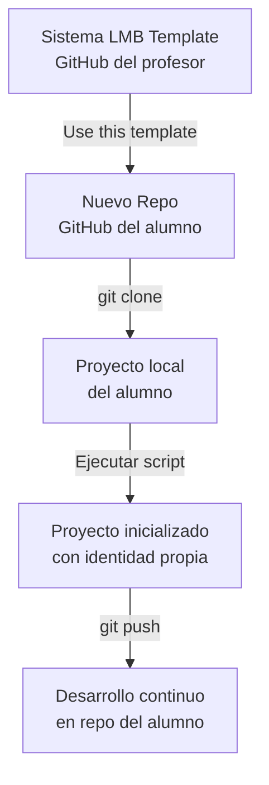
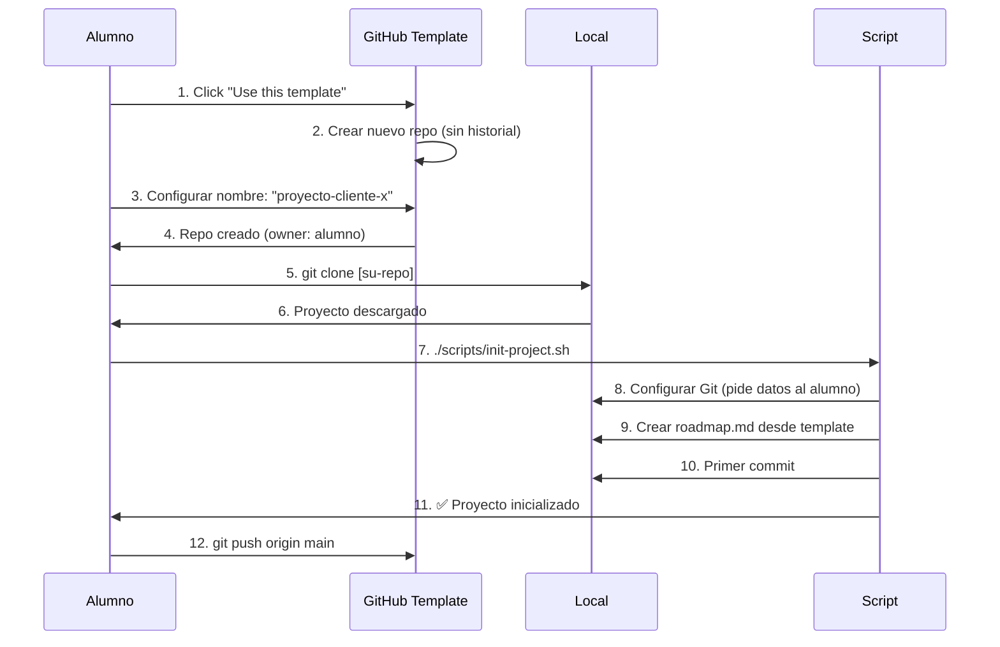

# Arquitectura: Sistema LMB como Template Reutilizable

## 📋 Índice

1. [Análisis del Problema](#análisis-del-problema)
2. [Solución Arquitectónica](#solución-arquitectónica)
3. [Flujos de Uso](#flujos-de-uso)
4. [Implementación Técnica](#implementación-técnica)
5. [Cambios en Documentación](#cambios-en-documentación)
6. [Script de Inicialización](#script-de-inicialización)
7. [Validación Final](#validación-final)

---

## 1. Análisis del Problema

### 1.1 Situación Actual

**Problema identificado**:
- Al configurar Git con datos personales del profesor, los alumnos heredarían esa identidad
- El template necesita estar "limpio" de configuraciones personales
- Cada alumno debe poder inicializar su propio proyecto desde cero

### 1.2 Requerimientos

✅ **Template debe ser**:
- Neutral (sin datos personales del profesor)
- Reutilizable (múltiples alumnos/proyectos)
- Auto-inicializable (script que configure el nuevo proyecto)
- Documentado (guía clara para alumnos)

✅ **Cada proyecto clonado debe**:
- Tener su propia identidad Git
- Poder conectarse al GitHub personal del alumno
- Mantener toda la estructura y funcionalidad del sistema
- NO heredar historial Git del template

---

## 2. Solución Arquitectónica

### 2.1 Estrategia Principal: GitHub Template Repository

**GitHub ofrece "Template Repositories"** que resuelven exactamente este problema.

**Características**:
- ✅ Al usar el template, GitHub crea un **repositorio nuevo** sin historial
- ✅ NO es un fork, es un **proyecto independiente**
- ✅ El alumno es **owner desde el inicio**
- ✅ NO hereda configuraciones Git del profesor
- ✅ Botón "Use this template" en GitHub

**Diagrama de flujo**:



### 2.2 Canales de Distribución

**Opción A: GitHub Template Repository (RECOMENDADA)**
- Profesor publica template en GitHub como "Template Repository"
- Alumnos usan botón "Use this template"
- Automático, limpio, profesional

**Opción B: Descarga ZIP**
- Profesor ofrece releases en GitHub
- Alumnos descargan ZIP
- Extraen y ejecutan script de inicialización

**Opción C: GitHub Releases + ZIP**
- Combinación de ambas
- Flexibilidad máxima

### 2.3 Componentes del Sistema

```
SISTEMA_LMB/
├── .git/                    # Historial del template (NO se copia)
├── .github/                 # Configuraciones GitHub Template
│   └── FUNDING.yml          # Opcional: patrocinio
├── .roo/                    # Agentes, skills, config
├── docs/                    # Documentación
├── plans/                   # Planes arquitectónicos
├── scripts/                 # 🆕 NUEVO: Scripts de utilidad
│   ├── init-project.sh      # Script inicialización (Bash/Linux/Mac)
│   ├── init-project.ps1     # Script inicialización (PowerShell/Windows)
│   └── README.md            # Documentación de scripts
├── .gitignore               # Excluye roadmap.md y artefactos de proyecto
├── CHANGELOG.md             # Historial de versiones del template
├── README.md                # Documentación principal del template
├── GETTING_STARTED.md       # 🆕 NUEVO: Guía para alumnos
├── LICENSE                  # 🆕 NUEVO: Licencia del template
└── roadmap.template.md      # Template de roadmap (copia a roadmap.md)
```

---

## 3. Flujos de Uso

### 3.1 Flujo Alumno: Iniciar Proyecto Nuevo (GitHub Template)



**Pasos detallados**:

1. **Usar el template** en GitHub:
   - Ir a: `https://github.com/yannicklmb/SISTEMA_LMB`
   - Click en "Use this template" → "Create a new repository"
   - Nombre: `proyecto-cliente-xyz`
   - Visibilidad: Pública o Privada
   - Click "Create repository"

2. **Clonar localmente**:
   ```bash
   git clone https://github.com/[alumno]/proyecto-cliente-xyz.git
   cd proyecto-cliente-xyz
   ```

3. **Ejecutar script de inicialización**:
   ```bash
   # Linux/Mac
   ./scripts/init-project.sh

   # Windows PowerShell
   .\scripts\init-project.ps1

   # Windows Git Bash
   bash scripts/init-project.sh
   ```

4. **Script pregunta**:
   - Nombre del proyecto
   - Nombre del cliente
   - Nombre completo del alumno (para Git)
   - Email del alumno (para Git)

5. **Script realiza**:
   - Configura `git config user.name` y `user.email` (local)
   - Copia `roadmap.template.md` → `roadmap.md`
   - Reemplaza placeholders con datos reales
   - Crea primer commit: "Initial project setup"
   - Muestra siguiente paso

6. **Alumno continúa**:
   ```bash
   git push origin main
   # Ya puede trabajar con el Jefe de Proyectos
   ```

### 3.2 Flujo Alumno: Descarga ZIP (Sin GitHub)

**Para alumnos que no usan GitHub**:

1. **Descargar ZIP**:
   - Ir a Releases en GitHub del profesor
   - Descargar `SISTEMA_LMB-v1.0.0.zip`
   - Extraer en carpeta del proyecto

2. **Ejecutar script**:
   ```bash
   cd proyecto-cliente-xyz
   ./scripts/init-project.sh
   ```

3. **Script pregunta** (igual que arriba)

4. **Script realiza**:
   - Inicializa Git desde cero: `git init`
   - Configura identidad Git local
   - Copia roadmap.template.md
   - Primer commit

5. **Alumno puede** (opcional):
   - Crear repo en su GitHub y conectar
   - O trabajar solo localmente
   - O usar otro sistema de versiones

---

## 4. Implementación Técnica

### 4.1 Configurar GitHub Template Repository

**En GitHub**:

1. Ir a `Settings` del repositorio
2. Sección "General"
3. Marcar checkbox: ☑️ **"Template repository"**
4. Guardar cambios

**Resultado**: Aparece botón "Use this template" en la página principal del repo.

### 4.2 Script de Inicialización (Bash)

**`scripts/init-project.sh`**:

```bash
#!/bin/bash

# Colores para output
GREEN='\033[0;32m'
BLUE='\033[0;34m'
YELLOW='\033[1;33m'
NC='\033[0m' # No Color

echo -e "${BLUE}━━━━━━━━━━━━━━━━━━━━━━━━━━━━━━━━━━━━━━━━━━━━━${NC}"
echo -e "${BLUE}  🏗️  Sistema LMB - Inicialización de Proyecto${NC}"
echo -e "${BLUE}━━━━━━━━━━━━━━━━━━━━━━━━━━━━━━━━━━━━━━━━━━━━━${NC}"
echo ""

# Verificar que estamos en la raíz del proyecto
if [ ! -f "roadmap.template.md" ]; then
    echo -e "${YELLOW}⚠️  Error: Ejecuta este script desde la raíz del proyecto${NC}"
    exit 1
fi

# Verificar que roadmap.md no existe ya
if [ -f "roadmap.md" ]; then
    echo -e "${YELLOW}⚠️  Advertencia: roadmap.md ya existe${NC}"
    read -p "¿Deseas sobrescribirlo? (s/N): " -n 1 -r
    echo
    if [[ ! $REPLY =~ ^[Ss]$ ]]; then
        echo "Operación cancelada."
        exit 1
    fi
fi

# Recopilar información del proyecto
echo -e "${GREEN}📋 Datos del Proyecto${NC}"
echo ""

read -p "Nombre del proyecto (ej: Web Restaurante Gourmet): " PROJECT_NAME
read -p "Nombre del cliente (ej: Restaurante El Buen Sabor): " CLIENT_NAME
read -p "Fecha de inicio (YYYY-MM-DD) [$(date +%Y-%m-%d)]: " START_DATE
START_DATE=${START_DATE:-$(date +%Y-%m-%d)}

echo ""
echo -e "${GREEN}👤 Tu Identidad (para Git)${NC}"
echo ""

read -p "Tu nombre completo: " USER_NAME
read -p "Tu email: " USER_EMAIL

echo ""
echo -e "${GREEN}⚙️  Configurando proyecto...${NC}"
echo ""

# Configurar Git (solo para este repositorio)
git config user.name "$USER_NAME"
git config user.email "$USER_EMAIL"
echo -e "  ✅ Git configurado (local a este proyecto)"

# Crear roadmap.md desde template
cp roadmap.template.md roadmap.md

# Reemplazar placeholders en roadmap.md
sed -i.bak "s/\[Nombre del Proyecto\]/${PROJECT_NAME}/g" roadmap.md
sed -i.bak "s/\[Nombre del Cliente\]/${CLIENT_NAME}/g" roadmap.md
sed -i.bak "s/\[Nombre\]/${USER_NAME}/g" roadmap.md
sed -i.bak "s/YYYY-MM-DD/${START_DATE}/g" roadmap.md
rm roadmap.md.bak 2>/dev/null

echo -e "  ✅ roadmap.md creado y personalizado"

# Verificar si es un repo Git
if [ ! -d ".git" ]; then
    echo -e "  📦 Inicializando repositorio Git..."
    git init
    git branch -M main
fi

# Stage y commit inicial
git add roadmap.md
git add .

# Crear commit inicial (solo si no hay commits previos)
if ! git rev-parse HEAD >/dev/null 2>&1; then
    git commit -m "Initial project setup: ${PROJECT_NAME}"
    echo -e "  ✅ Commit inicial creado"
fi

echo ""
echo -e "${GREEN}━━━━━━━━━━━━━━━━━━━━━━━━━━━━━━━━━━━━━━━━━━━━━${NC}"
echo -e "${GREEN}  ✨ Proyecto inicializado correctamente${NC}"
echo -e "${GREEN}━━━━━━━━━━━━━━━━━━━━━━━━━━━━━━━━━━━━━━━━━━━━━${NC}"
echo ""
echo -e "${BLUE}📌 Próximos pasos:${NC}"
echo ""
echo "  1. Revisar roadmap.md con los datos del proyecto"
echo "  2. Ejecutar: git push origin main (si ya configuraste remote)"
echo "  3. Iniciar con el Jefe de Proyectos (modo jefe-proyectos)"
echo "  4. Consultar docs/sistema-lmb.md para la metodología"
echo ""
echo -e "${YELLOW}💡 Consejo: Usa 'git remote add origin <URL>' si aún no configuraste el repositorio remoto${NC}"
echo ""
```

### 4.3 Script de Inicialización (PowerShell)

**`scripts/init-project.ps1`**:

```powershell
# Script de inicialización para Windows PowerShell
param(
    [switch]$SkipPrompts = $false
)

# Colores
$Green = "Green"
$Blue = "Cyan"
$Yellow = "Yellow"

Write-Host "━━━━━━━━━━━━━━━━━━━━━━━━━━━━━━━━━━━━━━━━━━━━━" -ForegroundColor $Blue
Write-Host "  🏗️  Sistema LMB - Inicialización de Proyecto" -ForegroundColor $Blue
Write-Host "━━━━━━━━━━━━━━━━━━━━━━━━━━━━━━━━━━━━━━━━━━━━━" -ForegroundColor $Blue
Write-Host ""

# Verificar que estamos en la raíz
if (-not (Test-Path "roadmap.template.md")) {
    Write-Host "⚠️  Error: Ejecuta este script desde la raíz del proyecto" -ForegroundColor $Yellow
    exit 1
}

# Verificar roadmap.md existente
if (Test-Path "roadmap.md") {
    Write-Host "⚠️  Advertencia: roadmap.md ya existe" -ForegroundColor $Yellow
    $overwrite = Read-Host "¿Deseas sobrescribirlo? (s/N)"
    if ($overwrite -notmatch '^[Ss]$') {
        Write-Host "Operación cancelada."
        exit 1
    }
}

# Recopilar información
Write-Host "📋 Datos del Proyecto" -ForegroundColor $Green
Write-Host ""

$projectName = Read-Host "Nombre del proyecto (ej: Web Restaurante Gourmet)"
$clientName = Read-Host "Nombre del cliente (ej: Restaurante El Buen Sabor)"
$startDate = Read-Host "Fecha de inicio (YYYY-MM-DD) [$(Get-Date -Format 'yyyy-MM-dd')]"
if ([string]::IsNullOrWhiteSpace($startDate)) {
    $startDate = Get-Date -Format 'yyyy-MM-dd'
}

Write-Host ""
Write-Host "👤 Tu Identidad (para Git)" -ForegroundColor $Green
Write-Host ""

$userName = Read-Host "Tu nombre completo"
$userEmail = Read-Host "Tu email"

Write-Host ""
Write-Host "⚙️  Configurando proyecto..." -ForegroundColor $Green
Write-Host ""

# Configurar Git
git config user.name "$userName"
git config user.email "$userEmail"
Write-Host "  ✅ Git configurado (local a este proyecto)"

# Crear roadmap.md
Copy-Item "roadmap.template.md" "roadmap.md"

# Reemplazar placeholders
$content = Get-Content "roadmap.md" -Raw
$content = $content -replace '\[Nombre del Proyecto\]', $projectName
$content = $content -replace '\[Nombre del Cliente\]', $clientName
$content = $content -replace '\[Nombre\]', $userName
$content = $content -replace 'YYYY-MM-DD', $startDate
Set-Content "roadmap.md" $content

Write-Host "  ✅ roadmap.md creado y personalizado"

# Verificar Git
if (-not (Test-Path ".git")) {
    Write-Host "  📦 Inicializando repositorio Git..."
    git init
    git branch -M main
}

# Commit inicial
git add roadmap.md
git add .

try {
    git rev-parse HEAD 2>$null
} catch {
    git commit -m "Initial project setup: $projectName"
    Write-Host "  ✅ Commit inicial creado"
}

Write-Host ""
Write-Host "━━━━━━━━━━━━━━━━━━━━━━━━━━━━━━━━━━━━━━━━━━━━━" -ForegroundColor $Green
Write-Host "  ✨ Proyecto inicializado correctamente" -ForegroundColor $Green
Write-Host "━━━━━━━━━━━━━━━━━━━━━━━━━━━━━━━━━━━━━━━━━━━━━" -ForegroundColor $Green
Write-Host ""
Write-Host "📌 Próximos pasos:" -ForegroundColor $Blue
Write-Host ""
Write-Host "  1. Revisar roadmap.md con los datos del proyecto"
Write-Host "  2. Ejecutar: git push origin main (si ya configuraste remote)"
Write-Host "  3. Iniciar con el Jefe de Proyectos (modo jefe-proyectos)"
Write-Host "  4. Consultar docs/sistema-lmb.md para la metodología"
Write-Host ""
Write-Host "💡 Consejo: Usa 'git remote add origin <URL>' si aún no configuraste el repositorio remoto" -ForegroundColor $Yellow
Write-Host ""
```

### 4.4 Estructura de `scripts/README.md`

```markdown
# Scripts de Utilidad - Sistema LMB

## Scripts Disponibles

### `init-project.sh` (Linux/Mac/Git Bash)

Script de inicialización para nuevos proyectos.

**Uso**:
```bash
./scripts/init-project.sh
```

**Requisitos**:
- Bash
- Git instalado
- Permisos de ejecución: `chmod +x scripts/init-project.sh`

---

### `init-project.ps1` (Windows PowerShell)

Script de inicialización para Windows.

**Uso**:
```powershell
.\scripts\init-project.ps1
```

**Requisitos**:
- PowerShell 5.1+
- Git instalado
- Política de ejecución: `Set-ExecutionPolicy -Scope Process -ExecutionPolicy Bypass`

---

## ¿Qué hace el script?

1. ✅ Configura tu identidad Git (local al proyecto)
2. ✅ Crea `roadmap.md` desde la plantilla
3. ✅ Personaliza con tus datos del proyecto
4. ✅ Inicializa repositorio Git (si no existe)
5. ✅ Crea commit inicial

## Troubleshooting

**Error: "Permission denied"**
```bash
chmod +x scripts/init-project.sh
```

**Error: PowerShell no ejecuta scripts**
```powershell
Set-ExecutionPolicy -Scope Process -ExecutionPolicy Bypass
```

**Error: sed command not found (Windows)**
- Usa PowerShell script en lugar de Bash
- O instala Git Bash
```

---

## 5. Cambios en Documentación

### 5.1 README.md Principal

**Sección a añadir** (al principio, después del título):

```markdown
## 🚀 Inicio Rápido (Para Alumnos/Nuevos Proyectos)

### Opción A: Usar GitHub Template (Recomendada)

1. **Usa este template**: Click en "Use this template" arriba
2. **Crea tu repo**: Nombre: `proyecto-cliente-xyz`
3. **Clona localmente**: 
   ```bash
   git clone https://github.com/[tu-usuario]/proyecto-cliente-xyz.git
   cd proyecto-cliente-xyz
   ```
4. **Inicializa proyecto**:
   ```bash
   # Linux/Mac/Git Bash
   ./scripts/init-project.sh
   
   # Windows PowerShell
   .\scripts\init-project.ps1
   ```
5. **Push inicial**:
   ```bash
   git push origin main
   ```

✅ **Listo para trabajar** con el Jefe de Proyectos

---

### Opción B: Descargar ZIP

1. **Descargar**: [Latest Release](https://github.com/yannicklmb/SISTEMA_LMB/releases/latest)
2. **Extraer** en carpeta del proyecto
3. **Ejecutar**: `./scripts/init-project.sh`
4. **(Opcional)** Conectar a tu GitHub

---

### Para Profesores/Mantenedores

Ver [CONTRIBUTING.md](CONTRIBUTING.md) para contribuir al template.

---
```

### 5.2 Crear GETTING_STARTED.md

**Nuevo archivo** con guía detallada para alumnos:

```markdown
# 🎓 Guía de Inicio - Sistema LMB

**Bienvenido al Sistema LMB**, un template profesional para proyectos WordPress bajo la metodología de La Máquina del Branding.

Esta guía te ayudará a **iniciar tu primer proyecto** paso a paso.

---

## 📋 Requisitos Previos

Antes de empezar, asegúrate de tener:

- ✅ **Git** instalado ([Descargar Git](https://git-scm.com/))
- ✅ **Cuenta de GitHub** (opcional pero recomendado)
- ✅ **Editor de código** (VS Code recomendado)
- ✅ **Roo Code** instalado (para usar los agentes)

---

## 🚀 Método 1: GitHub Template (Recomendado)

### Paso 1: Crear Tu Proyecto desde el Template

1. Ir a: https://github.com/yannicklmb/SISTEMA_LMB
2. Click en **"Use this template"** (botón verde)
3. Click en **"Create a new repository"**

**Configuración del nuevo repositorio**:
- **Repository name**: `proyecto-cliente-xyz` (usa el nombre real del proyecto)
- **Description**: "Proyecto web [Cliente] - Sistema LMB"
- **Visibilidad**: 
  - `Public` si quieres que sea visible
  - `Private` si es confidencial (requiere GitHub Pro/Teams)
- **Include all branches**: ⬜ Desmarcado
- Click en **"Create repository"**

✅ **Resultado**: Tienes un repositorio nuevo en tu cuenta, sin historial previo.

---

### Paso 2: Clonar el Proyecto Localmente

```bash
# Clonar tu nuevo repositorio
git clone https://github.com/[TU-USUARIO]/proyecto-cliente-xyz.git

# Entrar al directorio
cd proyecto-cliente-xyz
```

---

### Paso 3: Inicializar el Proyecto

Ejecuta el script de inicialización según tu sistema operativo:

**Linux / Mac / Git Bash**:
```bash
./scripts/init-project.sh
```

**Windows PowerShell**:
```powershell
.\scripts\init-project.ps1
```

**El script te preguntará**:
- Nombre del proyecto
- Nombre del cliente
- Fecha de inicio
- Tu nombre completo (para Git)
- Tu email (para Git)

✅ **El script configura automáticamente** todo el proyecto con tus datos.

---

### Paso 4: Subir el Proyecto a GitHub

```bash
# Verificar que todo está bien
git status

# Subir los cambios
git push origin main
```

✅ **Proyecto inicializado y en GitHub**

---

### Paso 5: Empezar a Trabajar

1. **Abrir con VS Code**:
   ```bash
   code .
   ```

2. **Cambiar al modo Jefe de Proyectos** en Roo Code

3. **Iniciar briefing**:
   > "Hola, quiero iniciar el proyecto [Nombre]. Vamos a hacer el briefing inicial."

4. **Seguir las fases** según `docs/sistema-lmb.md`

---

## 🚀 Método 2: Descarga ZIP (Sin GitHub)

### Paso 1: Descargar el Template

1. Ir a: https://github.com/yannicklmb/SISTEMA_LMB/releases/latest
2. Descargar `SISTEMA_LMB-v[version].zip`
3. Extraer en la carpeta donde quieras trabajar

---

### Paso 2: Inicializar el Proyecto

```bash
# Entrar al directorio extraído
cd SISTEMA_LMB-main

# Ejecutar script
./scripts/init-project.sh
```

El script:
- ✅ Inicializa Git desde cero
- ✅ Configura tu identidad
- ✅ Crea roadmap.md personalizado

---

### Paso 3: (Opcional) Conectar a GitHub

Si después quieres subir a GitHub:

1. **Crear repositorio vacío** en GitHub (sin README)
2. **Conectar**:
   ```bash
   git remote add origin https://github.com/[TU-USUARIO]/proyecto-xyz.git
   git push -u origin main
   ```

---

## 📚 Siguientes Pasos

### 1. Familiarízate con la Estructura

```
proyecto-cliente-xyz/
├── .roo/                  # Agentes y skills
│   ├── modes/             # 12 Custom Modes
│   └── skills/            # 28 Skills
├── docs/                  # Documentación
│   ├── sistema-lmb.md     # ⭐ Fuente de verdad
│   └── plantillas/        # Templates de artefactos
├── roadmap.md             # ⭐ Tu roadmap personalizado
└── README.md              # Documentación del template
```

### 2. Lee la Metodología

📖 **Archivo clave**: [`docs/sistema-lmb.md`](docs/sistema-lmb.md)

Contiene:
- 16 fases del sistema
- 12 roles/agentes
- Reglas obligatorias
- Validaciones

### 3. Usa los Custom Modes

En Roo Code, tienes 12 modos especializados:

- **🧭 Jefe de Proyectos**: Orquestador central (¡empieza aquí!)
- **🧠 Estratega**: Define estrategia de negocio
- **🗺 Planificador**: URLs y SEO
- **🧩 Wireframer**: UX y estructura
- **🧱 Arquitecto**: Modelo de datos WordPress
- **🎨 Diseñador**: Decisiones de diseño
- **⚙️ Implementador**: Configuración técnica
- **💻 Programador**: Código PHP/JS/CSS
- **🧱 Maquetador**: Templates y maquetación
- **🔐 Securizador**: Seguridad
- **🚀 Optimizador**: WPO y rendimiento
- **🧪 Testador**: QA y testing

### 4. Sigue las Fases

El sistema tiene **16 fases** (Fase 0 a Fase 15):

1. **Fase 0**: Setup
2. **Fase 1**: Estrategia
3. **Fase 2**: Planificación (URLs)
4. **Fase 3**: Wireframes
5. **Fase 4**: Stack
6. **Fase 5**: Arquitectura
7. **Fase 6**: Diseño
8. **Fase 6b**: Contenidos
9. **Fase 7**: Inserción de contenido
10. **Fase 8**: Plugins
11. **Fase 9**: Framework CSS
12. **Fase 10**: Maquetación
13. **Fase 11**: Seguridad
14. **Fase 12**: WPO
15. **Fase 13**: Testing
16. **Fase 14**: Pre-lanzamiento
17. **Fase 15**: Post-lanzamiento

---

## ❓ Preguntas Frecuentes

### ¿Necesito saber Git?

**Básico**: Sí, necesitas comandos básicos:
- `git clone`
- `git add`
- `git commit`
- `git push`

**Aprende más**: [Git - La Guía Sencilla](https://rogerdudler.github.io/git-guide/index.es.html)

---

### ¿Puedo usar esto sin GitHub?

**Sí**, puedes:
- Trabajar solo localmente (Git local)
- Usar otro hosting (GitLab, Bitbucket)
- Compartir por Dropbox/Drive (no recomendado)

Pero GitHub facilita mucho la colaboración.

---

### ¿Qué hago si no tengo Roo Code?

El template funciona con cualquier editor, pero **Roo Code** es esencial para usar los **Custom Modes** y **Skills**.

Alternativas:
- Usar manualmente las plantillas en `docs/plantillas/`
- Leer `docs/sistema-lmb.md` y seguir la metodología
- Instalar Roo Code (recomendado)

---

### ¿Puedo modificar el template?

**Sí**, cada proyecto es único. El template es una **base**, no una camisa de fuerza.

Pero **respeta las reglas obligatorias** en `docs/sistema-lmb.md`:
- Mínimo content, máximo campos personalizados
- WooCommerce para transaccionales
- Validaciones cruzadas
- etc.

---

## 🆘 Ayuda

**Documentación**:
- [`docs/sistema-lmb.md`](docs/sistema-lmb.md): Metodología completa
- [`README.md`](README.md): Resumen del template

**Soporte**:
- Consulta en la comunidad de La Máquina del Branding
- Crea un issue en GitHub (si tienes permisos)

---

## ✅ Checklist de Inicio

Antes de empezar con el cliente:

- [ ] Template clonado/descargado
- [ ] Script de inicialización ejecutado
- [ ] `roadmap.md` personalizado
- [ ] Proyecto en GitHub (o Git local)
- [ ] Roo Code configurado
- [ ] `docs/sistema-lmb.md` leído (al menos Fases 0-3)
- [ ] Jefe de Proyectos activado

✅ **¡Listo para empezar!**

---

**Versión**: 1.0.0  
**Última actualización**: 2025-01-20
```

### 5.3 Actualizar .gitignore

**Verificar que incluye** (ya lo tiene, pero confirmar):

```gitignore
# Roadmap del proyecto (cada proyecto tiene el suyo)
/roadmap.md
```

Esto asegura que:
- ✅ `roadmap.template.md` SÍ se versiona (es parte del template)
- ✅ `roadmap.md` NO se versiona (es específico del proyecto)

---

## 6. Validación Final

### 6.1 Checklist de Limpieza del Template

Antes de publicar, verificar que NO hay:

- [ ] ❌ Datos personales del profesor
- [ ] ❌ Configuración Git con identidad específica
- [ ] ❌ `roadmap.md` con datos de proyecto real
- [ ] ❌ Credenciales o API keys
- [ ] ❌ Historial Git con commits de proyectos anteriores
- [ ] ❌ Archivos temporales o de desarrollo

Debe tener:

- [ ] ✅ `roadmap.template.md` limpio con placeholders
- [ ] ✅ Scripts de inicialización funcionales
- [ ] ✅ GETTING_STARTED.md completo
- [ ] ✅ README.md con instrucciones claras
- [ ] ✅ .gitignore que excluye artefactos de proyecto
- [ ] ✅ Todos los Custom Modes y Skills
- [ ] ✅ Documentación completa en `docs/`

### 6.2 Test del Template

**Probar manualmente**:

1. **Crear nuevo repo desde template** en GitHub
2. **Clonar localmente**
3. **Ejecutar script**: `./scripts/init-project.sh`
4. **Verificar**:
   - ✅ `roadmap.md` creado con datos correctos
   - ✅ Git configurado con identidad del usuario
   - ✅ Commit inicial creado
   - ✅ Push a GitHub funciona
5. **Verificar que NO aparece** ningún dato del profesor

---

## 7. Publicación y Distribución

### 7.1 Configurar como GitHub Template

1. Ir a **Settings** del repo
2. Sección **General**
3. ☑️ Marcar **"Template repository"**
4. Guardar

### 7.2 Crear Release v1.0.0

1. Ir a **Releases** → **Create a new release**
2. **Tag**: `v1.0.0`
3. **Title**: `Sistema LMB Template v1.0.0`
4. **Description**:

```markdown
# 🎉 Sistema LMB Template v1.0.0

Primera versión estable del **Sistema LMB** como template reutilizable.

## 📦 ¿Qué incluye?

- ✅ **12 Custom Modes** (roles especializados)
- ✅ **28 Skills** (procedimientos reutilizables)
- ✅ **8 Templates** de artefactos
- ✅ **Script de inicialización** automática
- ✅ **Documentación completa**
- ✅ **16 fases** metodológicas

## 🚀 Inicio Rápido

### Opción 1: GitHub Template

1. Click en **"Use this template"**
2. Crear nuevo repositorio
3. Clonar: `git clone [tu-repo]`
4. Inicializar: `./scripts/init-project.sh`

### Opción 2: Descarga ZIP

1. Descargar `SISTEMA_LMB-v1.0.0.zip` abajo
2. Extraer en carpeta del proyecto
3. Ejecutar: `./scripts/init-project.sh`

## 📚 Documentación

- 📖 [Guía de Inicio (GETTING_STARTED.md)](GETTING_STARTED.md)
- 📖 [Metodología Completa (docs/sistema-lmb.md)](docs/sistema-lmb.md)
- 📖 [README Principal](README.md)

## 🔧 Requisitos

- Git
- Roo Code (para usar Custom Modes)
- WordPress ≥ 6.0 (para el proyecto final)

---

**¿Dudas?** Consulta [GETTING_STARTED.md](GETTING_STARTED.md)
```

5. **Adjuntar**: GitHub auto-genera el ZIP
6. **Publicar release**

### 7.3 Comunicar a Alumnos

**Mensaje para alumnos**:

```
🎓 ¡Sistema LMB Template Disponible!

He preparado un template profesional para vuestros proyectos WordPress.

📍 Repo: https://github.com/yannicklmb/SISTEMA_LMB

🚀 Inicio rápido:
1. Click en "Use this template"
2. Crear vuestro repo
3. Clonar y ejecutar: ./scripts/init-project.sh
4. ¡A trabajar!

📖 Guía completa: https://github.com/yannicklmb/SISTEMA_LMB/blob/main/GETTING_STARTED.md

Cualquier duda, consultad la documentación o preguntad.

¡Éxito con vuestros proyectos! 💪
```

---

## 8. Mantenimiento Futuro

### 8.1 Actualizaciones del Template

Cuando se actualice el template:

1. **Hacer cambios** en el repo principal
2. **Incrementar versión** en CHANGELOG.md
3. **Crear nuevo release**: `v1.1.0`, `v1.2.0`, etc.
4. **Comunicar cambios** a usuarios

**Los alumnos pueden**:
- Ver el changelog
- Aplicar cambios manualmente a sus proyectos
- O empezar proyectos nuevos con la última versión

### 8.2 Issues y Mejoras

Configurar **GitHub Issues** para:
- Reportar bugs del template
- Sugerir mejoras
- Hacer preguntas

**Etiquetas**:
- `bug`: Errores en el template
- `enhancement`: Mejoras propuestas
- `question`: Preguntas sobre uso
- `documentation`: Mejoras en docs

---

## 9. Ventajas de esta Arquitectura

### ✅ Para el Profesor

- **Mantenimiento centralizado**: Un solo repo del template
- **Control de versiones**: Releases claros
- **Sin datos sensibles**: Template limpio
- **Escalable**: Funciona para 1 alumno o 100

### ✅ Para los Alumnos

- **Fácil de usar**: "Use this template" + script
- **Independencia total**: Su proyecto, su repo
- **Sin herencias**: Historial Git limpio desde el inicio
- **Profesional**: Aprenden buenas prácticas Git

### ✅ Para el Sistema

- **Consistencia**: Todos parten de la misma base
- **Trazabilidad**: Cada proyecto es independiente
- **Colaboración**: Fácil compartir con equipos
- **Evolutivo**: Template mejora sin afectar proyectos existentes

---

## 10. Resumen Ejecutivo

### Problema
Conectar el template al GitHub del profesor hace que alumnos hereden su identidad Git.

### Solución
**GitHub Template Repository** + **Script de inicialización**

### Componentes
1. Marcar repo como "Template Repository" en GitHub
2. Crear scripts de inicialización (`init-project.sh`, `init-project.ps1`)
3. Añadir `GETTING_STARTED.md` con guía para alumnos
4. Actualizar `README.md` con instrucciones claras
5. Asegurar que `roadmap.template.md` tiene placeholders
6. Verificar `.gitignore` excluye `roadmap.md`

### Resultado
- ✅ Alumnos usan "Use this template" → repo independiente
- ✅ Script configura identidad Git del alumno
- ✅ Cada proyecto tiene su propio historial limpio
- ✅ Template se mantiene neutral y reutilizable

---

## 11. Próximos Pasos (Implementación)

### Fase 1: Preparación (1 hora)
- [ ] Crear carpeta `scripts/`
- [ ] Crear `scripts/init-project.sh`
- [ ] Crear `scripts/init-project.ps1`
- [ ] Crear `scripts/README.md`
- [ ] Dar permisos ejecución: `chmod +x scripts/init-project.sh`

### Fase 2: Documentación (2 horas)
- [ ] Crear `GETTING_STARTED.md`
- [ ] Actualizar `README.md` (sección Inicio Rápido)
- [ ] Verificar `roadmap.template.md` tiene placeholders
- [ ] Verificar `.gitignore` excluye `roadmap.md`

### Fase 3: Validación (30 min)
- [ ] Probar script en Linux/Mac
- [ ] Probar script en Windows
- [ ] Probar flujo completo "Use this template"
- [ ] Verificar que NO hay datos personales

### Fase 4: Publicación (30 min)
- [ ] Commit y push de cambios
- [ ] Configurar como Template Repository en GitHub
- [ ] Crear Release v1.0.0
- [ ] Comunicar a alumnos

**Tiempo total estimado**: ~4 horas

---

## 12. Alternativas Consideradas (y descartadas)

### ❌ Opción A: Fork del Repo
**Problema**: Los forks mantienen vínculo con el original, no son independientes.

### ❌ Opción B: Clonar y Cambiar Remote
**Problema**: Hereda historial Git completo, no es limpio.

### ❌ Opción C: Descargar ZIP Siempre
**Problema**: No aprovecha GitHub, menos profesional.

### ✅ Opción D: GitHub Template (ELEGIDA)
**Ventajas**: 
- Repos independientes
- Sin historial heredado
- Profesional y escalable
- Nativo de GitHub

---

**FIN DEL DOCUMENTO**

---

**Autor**: Arquitecto - Sistema LMB  
**Fecha**: 2025-01-20  
**Versión**: 1.0  
**Estado**: Propuesta para revisión
